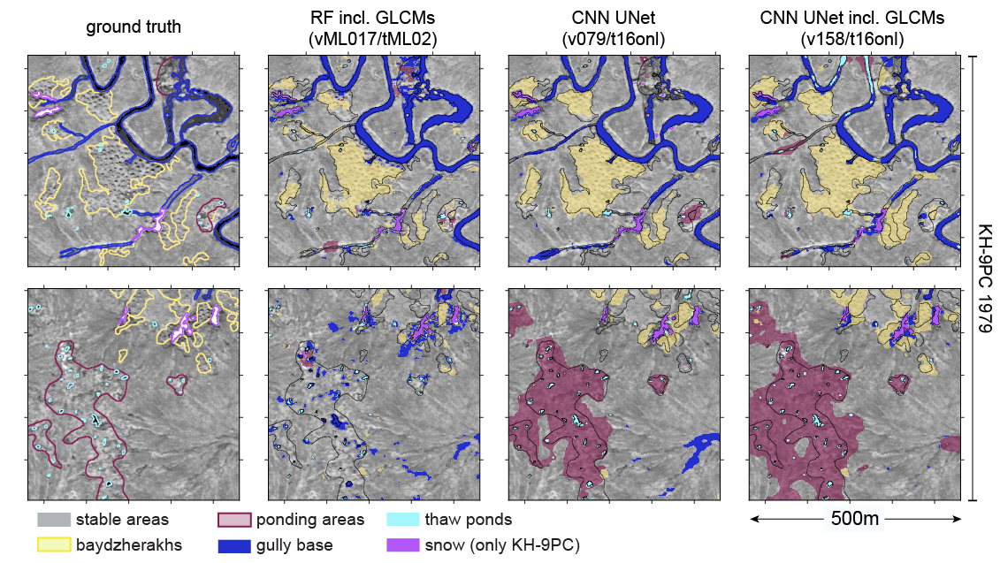
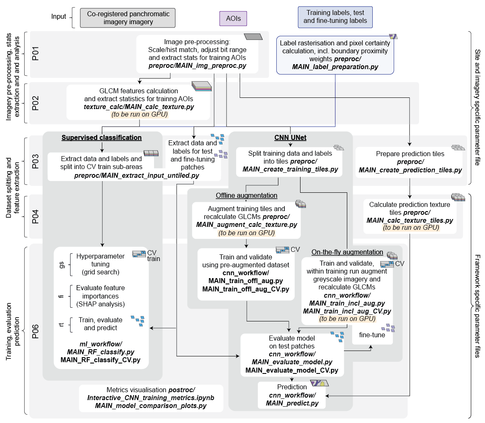

# Script for the segmentation of permafrost degradation stages
## Introduction
This repository provides the code used in the following paper: 

---

*PREPRINT: Inauen, C., Nitze, I, Langer, M., Morgenstern, A., Hajnsek, I., Grosse, G. (2025). Using texture-based image segmentation and machine learning with high-resolution satellite imagery to assess permafrost degradation in the Russian High Arctic. ESS Open Archive. February 15, 2025. DOI: https://doi.org/10.22541/essoar.173965735.56131153/v1*

---

The paper's aim is to classify permafrost landscapes into different degradation stages according to their specific textural characteristics on panchromatic historical and recent satellite imagery.

For the full results please check the paper and the accompanying data, which is provided on Zenodo:
- data: *http://dx.doi.org/10.5281/zenodo.15325742* (NOT YET PUBLIC)
- example processing data: *http://dx.doi.org/10.5281/zenodo.15325757* (NOT YET PUBLIC)
 

## Script structure
### Overview
The code in this repository allows testing different segmentation approaches, including:

- Random Forest using grey level co-occurrence matrices (GLCM) features
- CNN U-Net segmentation using different framework adjustments, such as:

	- The usage of different normalisation types
    - The usage of different strengths of augmentation
	- Including different weighting schemes
        - class weights to address class-imbalance
        - pixel based uncertainty weights
	- Including GLCM features as input features
 

### Workflow

The workflow can be summarised as follows: 
 

More detailed descriptions of the processing steps can be found here:

* [Pre-processing](docs/Proc_step_summary_pre-processing.md)
* [ML Segmentation](docs/Proc_step_summary_ml_workflow.md)
* [CNN Segmentation](docs/Proc_step_summary_cnn_workflow.md)

Various segmentation frameworks setups can be tested by selecting:

 -  Different feature preparation options as described in: 
    [ML feature preparation options](docs/PARAM_options_feature_preparation_ML.md) and
    [CNN feature preparation options](docs/PARAM_options_feature_preparation_CNN.md)
 - Training options as as described in: 
    [ML training options](docs/PARAM_options_training_ML.md) and
    [CNN training options](docs/PARAM_options_training_CNN.md)
 

## Example
An example on how to setup and use this code can be found in
the *example* folder see:
[example description](example/README.md)
 

## Installation
For instructions on how to run this script see:
[INSTALL](docs/INSTALL.md)
 

## Used modules and data
This repository uses a large set of python modules. Please see the .yml
files for a full list of the modules.
The key modules include:

 - Raster manipulation [xarray](https://github.com/pydata/xarray) and
   [rioxarray](http://github.com/corteva/rioxarray)
   and [xarray-spatial](https://github.com/makepath/xarray-spatial)
 - Vecor data analysis: [geopandas](https://github.com/geopandas/geopandas)
   and [shapely](https://github.com/shapely/shapely)
 - Image pre-procesing: [scikit-image](https://github.com/scikit-image/scikit-image)
 - GLCM features calculation: [glcm-cupy](https://github.com/Eve-ning/glcm-cupy)
 - CNN workflow: [pytorch](https://pytorch.org/) and
   [segmentation_models_pytorch](https://github.com/qubvel-org/segmentation_models.pytorch)
   and [albumentations](https://albumentations.ai/)
 - ML workflow: [scikit-learn](https://github.com/scikit-learn/scikit-learn)
   and [cuML rapids](https://github.com/rapidsai/cuml)
 - For figure creation: [matplotlib](https://matplotlib.org/),
   [seaborn](https://seaborn.pydata.org/) and [holoviews](https://holoviews.org/)

The example included in this repository contains a small subset of Hexagon
(KH-9PC) imagery. The original data was provided by the United States
Geological Survey Earth Resources Observation and Science (EROS) Center
 and can be downloaded from the [EarthExplorer](https://earthexplorer.usgs.gov/).
 

## License
Please see [LICENSES](LICENSE.md) for information about how the content is
licensed.
 

## Citation
If you use this work, please cite the accompanying paper on top of this page.

