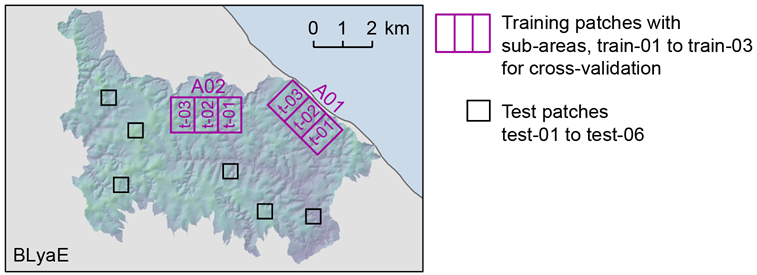

# Pre-processing (P01 to P04)
## Summary
The pre-processing is run separately per site and satellite imagery.
It prepares the required input for the segmentation.
(all processing is done in the 1_site_preproc folder and in a site specific subfolder)

Input parameters have to be defined in site and imagery specific
parameter files. The follwing inputs are required:

 - Input data: in this project the input data is a single-band panchromatic
   imagery
 - Training labels: in this project, the labels consist of 6 classes
   categorising the landscape into 6 permafrost degradation stages
 - Spatial extent of the processing areas (AOIs): they define the extent
   of the training areas and the distributed test patches. The training
   areas can be further subdivided into additional sub-areas for
   cross-validation (see image below)
 - Type of intensity scaling and quantization to use: the best scaling type
   can be selected through visual inspection of the histograms. It
   should bring the grey tones of all input data (the panchromatic imagery)
   into a similar range.
 - Tiles size for the CNN segmentation

Example of the training and test patches for the site BLyaE: 

An example of a parameter file can be found in: 
*example/1_site_preproc/BLyaE_v1/01_input/*
*PROJ_PARAM_BLyaE_HEX1979_scale_perc02_g03_8bit_v01.py* 
It can be used for all pre-processing steps (P01 to P04).

## P01: Image intensity adjustment

This step adjusts the intensity range of the panchromatic imagery.
It creates various options of scaled imagery by scaling or histogram
matching. The goal is to bring the different panchromatic imagery into
similar grey tone ranges. Additionally, it converts all imagery into
the same bit range (e.g. HEX is 8bit whereas SPOT is 16bit). The best
scaling option can be selected through visual inspections of the
resulting histograms.

**Script** *preproc/MAIN_img_preproc.py* 

**Input** (from 01_input)

  - Georeferenced panchromatic imagery (.tif)
  - Full area AOI (.geojson)

**Output** (in 02_pre_proc)

 - Intensity adjusted panchromatic imagery imagery (**base file**)  
   e.g. BLyaE_HEX1979_scale_perc0-2_g0-3_8bit.tif  
   `{site}_{imagery_tag}_{scaling_type}_{bit_depth}.tif`
 - Metadata file with file names and stats  
    e.g. BLyaE_HEX1979_P01_img_proc_file.txt
 - Histogram plots (.pdf)

**Additional processing step specific parameters** (not required to be adjusted): 
  *param_settings/PARAM01_img_preproc.py*

## P02: Texture calculation (requires to be run on GPU)
In this step, GLCM texture features are calculated for the entire area.
They can be calculated with different GLCM-window sizes and directions.
GLCM features are calculated for each pixel value of the entire image
by using a moving window.
The script uses the python module glcm_cupy https://eve-ning.github.io/glcm-cupy/
for the GLCM feature calculation.

**Script:** *texture_calc/MAIN_calc_texture.py* 
(to be run on GPU)

Input (from 02_pre_proc)

  - Intensity adjusted imagery 
    e.g. *BLyaE_HEX1979_scale_perc0-2_g0-3_8bit.tif*

Output (in 02_pre_proc)

  - Base file used for GLCM calculation
    e.g. *BLyaE_HEX1979_all_perc0-2_g0-3_8bit_raw.tif* 
    `{site}_{imagery_tag}_{area tag}_{scaling_type}_{bit_depth}.tif` = **base file name**
  - Spearate GLCM files per GLCM-parameters. Each file contains all GLCM
    features. Thus, they consist of 7 bands (HOMOGENEITY, CONTRAST, ASM, VAR,
    CORRELATION, DISSIMILARITY, MEAN) 
    e.g. *BLyaE_HEX1979_all_perc0-2_g0-3_8bit_a0-1-2-3_r05_norm_C01.tif* 
    `{base file name}_{derived_feature_tag}.tif` 
    The derived_feature_tag describes the GLCM parameters:
     - <u>measurement directions</u> e.g. a0-1-2-3 (0, 1, 2, 3 are all
      directions E, SE, S, SW)
     - <u>window radius</u> e.g. r05 -> window size = 11 pixels
     - <u>norm tag</u>: "norm" means that the GLCM features ranges were
       moved to the [0, 1] range (from the min and max possible values,
       not from the actual min max values)
     - <u>channel number</u>: C01 the amount of channels from which the
       GLCMs were derived (here single channel data --> C01)
       (for more details check: [file structure](file_structure_naming.md))
  - Metadata file containing the created files:
    *BLyaE_HEX1979_all_perc0-2_g0-3_8bit_P02_tex_proc_file.txt*
  - Statistics file per training sub-area (the stats can later be used
    for image standardisation)
    e.g. *BLyaE_HEX1979_A02train-01_perc0-2_g0-3_8bit_P02_tex_stats_file.txt*
  - Various plots (.pdf)

**Additional processing specific parameters** (not required to be adjusted): 
*param_settings/PARAM02_calc_texture.py*

## P03: Extraction of untiled input
Extracts untiled input data e.g. for the Random Forest training and for
testing or fine-tuning on untiled patches.

**Script:** *preproc/MAIN_extract_input_untiled.py*

**Input**

  - Intensity adjusted imagery (base data) 
    e.g. *BLyaE_HEX1979_scale_perc0-2_g0-3_8bit.tif* (in 02_pre_proc)
  - Ground truth: Manually labelled classes (band 1) and optionally
    pixel weights for uncertainty/sample weighting (band 2) 
    e.g. *BLyaE_HEX1979_training_A02_labels_Lv01_class_certainty.tif* 
    or *BLyaE_HEX1979_test_patch1_labels_Lv01_class_certainty.tif*
    (in 00_labelling)
  - AOIs: .geojson files to extract the required spatial coverage 
    e.g. *BLyaE_labelling_AOI_32654_A02train-01.geojson*,
    *BLyaE_labelling_AOI_32654_test-01.geojson*
    (in 01_input)

**Output** (in 03_train_inp)

  - Untiled training data (base data, derived features (GLCMs) and label files) 
    The files are saved in a separate subfolder per training area or a
    separate subfolder for testing or fine tuning. 
    e.g. training folder *BLyaE_HEX1979_A02_perc0-2_g0-3_8bit_Lv01_untiled_v00* 
    e.g. testing folder *BLyaE_HEX1979_test_perc0-2_g0-3_8bit_Lv01_untiled_v00* 
    (for file structure see [file structure](file_structure_naming.md))

**Additional processing specific parameters** (not required to be adjusted): 
param_settings/PARAM03_extract_data.py

## P03: tiling data for CNN training
Creates overlapping training tiles for CNN segmentation.
To avoid an overlap of the training and validation data, the tiling is done
separately on the training-sub areas. Furthermore, the tiles are chosen
slightly larger than the training tile size to be able to cut-off edge
effects after GLCM calculation.

**Script:** *preproc/MAIN_create_training_tiles.py*

**Input**

  - Intensity adjusted imagery (base data) 
    e.g. *BLyaE_HEX1979_scale_perc0-2_g0-3_8bit.tif* (in 02_pre_proc)
  - Ground truth: Manually labelled classes (band 1) and optionally
    pixel weights for uncertainty/sample weighting (band 2) 
    e.g. *BLyaE_HEX1979_training_A02_labels_Lv01_class_certainty.tif* 
    (in 00_labelling)
  - AOIs: .geojson files to extract required areal coverage 
    e.g. *BLyaE_labelling_AOI_32654_A02train-01.geojson*,
    (in 01_input)

**Output** (in 03_train_inp)

  - Training tiles (base data, and label files) 
    They are saved in a separate subfolder per scaling, training area and window size 
    e.g. folder *BLyaE_HEX1979_A02_perc0-2_g0-3_8bit_Lv01_w298-298_v00* 
    (for file structure see [file structure](file_structure_naming.md)),
    Note: the window size w298-298 refers to a buffered window size to
    avoid edge effects. After GLCM calculation the file are center cropped
    to the selected window size (e.g. 256)
  - Metadata files per traning sub-area listing the tile names (for reading
    in data during training) and the corresponding class counts (for later
    class weighting). 
    e.g. *BLyaE_HEX1979_A02train-01_meta_data.txt*
  - Overview plots of the tiling

**Additional processing specific parameters** (not required to be adjusted): 
param_settings/PARAM03_extract_data.py

## P03: tiling data for CNN prediction
Creates overlapping prediction tiles for CNN prediction.

**Script:** *preproc/MAIN_create_prediction_tiles.py*

**Input**

  - Intensity adjusted imagery (base data) 
    e.g. *BLyaE_HEX1979_scale_perc0-2_g0-3_8bit.tif* (in 02_pre_proc)
  - AOIs: full area AOI (in 01_input)

**Output** (in 03_train_inp)

  - Prediction tiles (base data)
    They are saved in a separate subfolder per scaling and window size 
      e.g. folder *BLyaE_HEX1979_all_perc0-2_g0-3_8bit_w298-298_v00* 
  - Metadata file listing all prediction tiles
    (for reading in data for prediction) 
    e.g. *BLyaE_HEX1979_all_meta_data.txt*

**Additional processing specific parameters** (not required to be adjusted): 
param_settings/PARAM03_extract_data.py

## P04: Augment training tiles and recalculate GLCMs
Augments the training tiles and recalculates the GLCMs. This is later
as input for the training with offline augmentation. 
Note: Offline augmentation should mainly be considered for fast testing
as it is much faster than on-the-fly augmentation. However, it is prone
to overfitting.

**Script:** *preproc/MAIN_augment_calc_texture.py*

**Input**

  - Training tiles with base data 
    e.g. from folder *BLyaE_HEX1979_A02_perc0-2_g0-3_8bit_Lv01_w298-298_v00* (in 03_train_inp)

**Output** (in 03_train_inp, same subfolder as input)

  - Augmented training tiles (base data) and recalculated GLCMs 
    e.g. *BLyaE_HEX1979_A02train-03_03_02-01_data_a0-1-2-3_r05_norm_C01.tif* (unaugmented GLCMs) 
    `{site}_{imagery tag}_{area tag}_{shift number}_{tile local coord}_data_{derived_feature_tag}.tif`
    e.g. *BLyaE_HEX1979_A02train-03_03_02-01_data_aug1-01.tif* (augmented image) 
    e.g. *BLyaE_HEX1979_A02train-03_03_02-01_data_aug1-01_a0-1-2-3_r05_norm_C01.tif* (GLCMs calculated after augmentation) 
    The augmentation tag corresponds to aug1-01 = augmentation type 1, first augmentation number
  - Metadata file listing the augmeted files and the corresponding class
    counts for later class weighting.
    Note: the GLCMs files are not listed as they are later read-in by
    adding the `derived_feature_tag` to the base image name. 
    e.g. *BLyaE_HEX1979_A02train-01_meta_data_augment_Av1.txt* ("Av1" is
    an identifier for the augmentation type)

**Additional processing specific parameters** (not required to be adjusted): 
param_settings/PARAM04_augment_data.py

## P04: Calculate GLCMs of prediction tiles
Calculates the GLCM features of the prediction tiles.

**Script** *preproc/MAIN_calc_texture_tiles.py*

**Input**

  - Prediction tiles with base data 
    e.g. from folder *BLyaE_HEX1979_all_perc0-2_g0-3_8bit_w298-298_v00* (in 03_train_inp)

**Output** (in 03_train_inp, same subfolder as input)

  - Calculated GLCMs. GLCM-features cacluated with different parameter
    setups are saved as separate .tif tiles. 
    e.g. *BLyaE_HEX1979_all_00_00-01_data_a0-1-2-3_r05_norm_C01.tif*
    or *BLyaE_HEX1979_all_00_00-01_data_r05_calc_std.tif* 

**Additional processing specific parameters** (not required to be adjusted): 
param_settings/PARAM04_augment_data.py